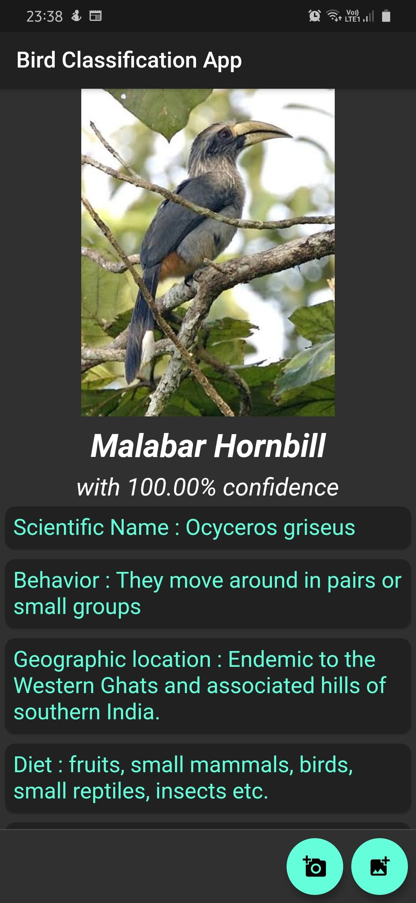
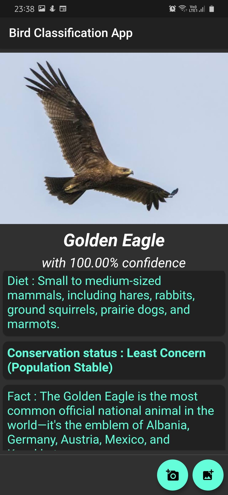
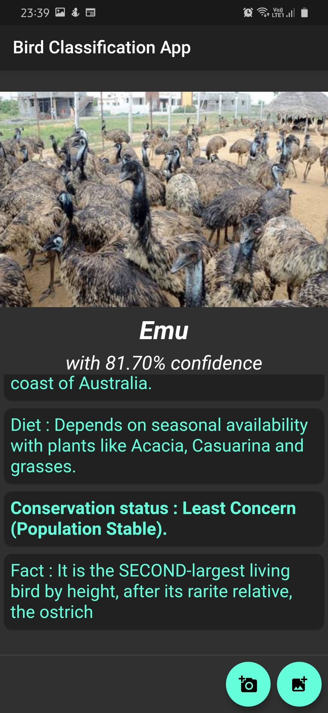
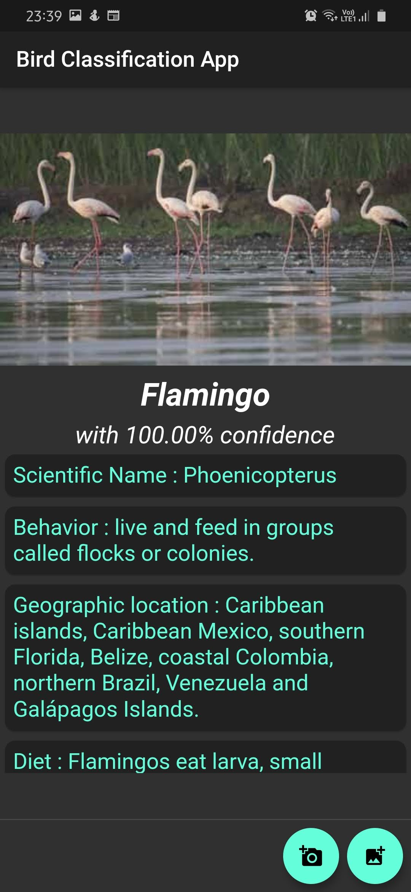
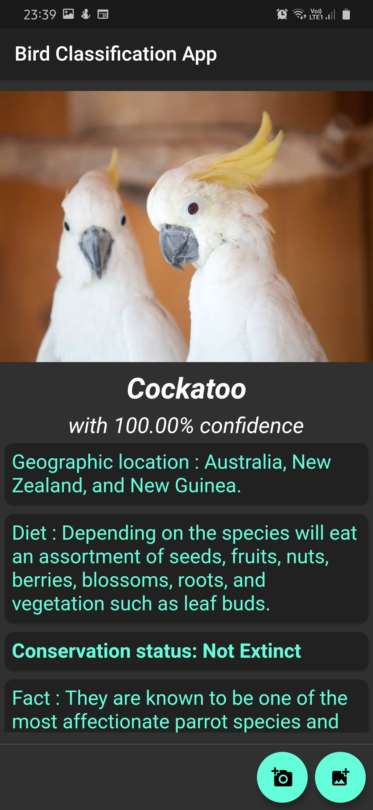
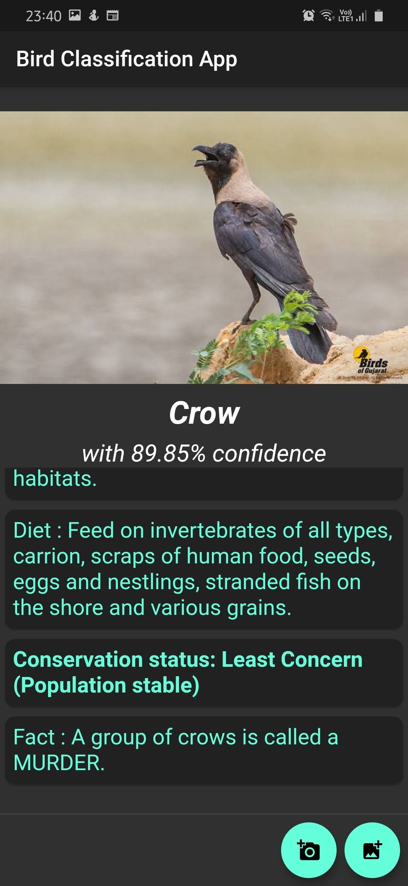
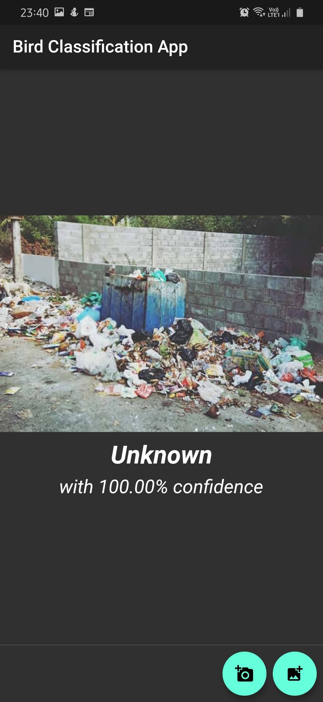
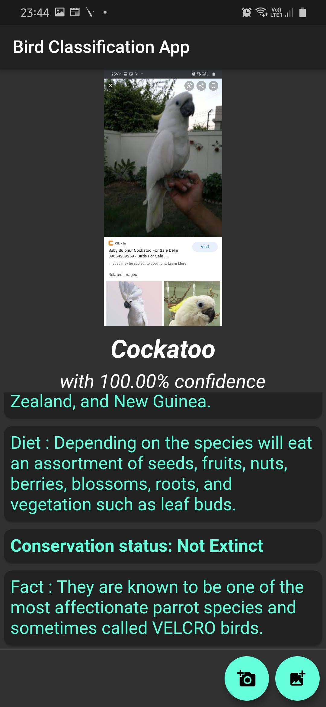

# BIRDOO: A Bird Classification App
An Android App to classify different species of birds

## **DESIGN APPROACH:**
1.  The first step is to collect the dataset. The objective of the project was to classify Indian Birds. Hence, the dataset was collected from Kaggle.com and handpicked Google Images. 
2.  All the images in the dataset are first converted to integer arrays by considering the intensity values of each pixel; and it is subsequently converted into a 224x224x3 matrix (3– Red, Green and Blue). 
3.  Seven species of birds commonly found in India were chosen to be included in the model. Hence, it becomes a 7-class classification problem and thus each image is given a label number ranging from 0 to 6. Each label number corresponds to one of the 7 classes. Then all images are converted to NumPy arrays.
4.  The images are now fitted onto four models - VGG16, VGG19, ResNet-50 and Inception V3. Performance metrics like training and testing accuracies, along with the loss, detection rates and false alarm rates of the four algorithms are compared and the best suited is selected as the final model. **VGG19 fares better than the other four models**, hence it is selected as the base model for this neural network.
5.  Once the images are trained on the selected model, the weights are saved to TensorFlow Lite model, which can be loaded into an android application. Flutter is used to build the android application.

## **BLOCK DIAGRAM:**

##  **THE NEURAL NETWORK MODEL USED:**

## **RESULTS IN APP:**

## **LINKS TO APP AND DEMO:**

<a href="https://drive.google.com/drive/folders/1QiKa8gOog-H4ZXrEzv1llfhdHPAn84_q?usp=sharing" target="_blank">The Android apk</a>
 
<a href="https://drive.google.com/file/d/1XjZKvrDUvW4DWdNIMwREMv8jydia0er5/view?usp=sharing" target="_blank">A Video Demo</a>
 

There are 2 choices in the App - Upload by taking real time pic and Upload from Gallery.
